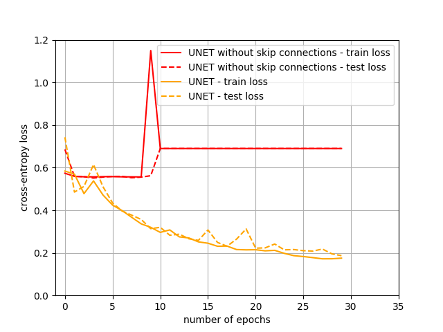

# Semantic Segmentation
A Salt Identification Case Study

## Use the code

Download the data files from [here](https://www.kaggle.com/c/tgs-salt-identification-challenge/data)

Unzip the file ```train.zip``` in the folder ```data```of this repository. You should have ```data/images``` and ```data/masks```.

Run the file ```python3 main.py```.

## Model explanation

The input data are images with a size of 110 by 110 pixels. They are resized using ```torchvision.transform.Resize((128,128))``` to fit 128 by 128 pixels.

Here is the bases model used.

```
NeuralNetwork(
  (conv1_1): Conv2d(3, 16, kernel_size=(3, 3), stride=(1, 1), padding=(1, 1))
  (conv1_2): Conv2d(16, 16, kernel_size=(3, 3), stride=(1, 1), padding=(1, 1))
  (relu1): ReLU()
  (pool1): MaxPool2d(kernel_size=2, stride=2, padding=0, dilation=1, ceil_mode=False)
  (conv2_1): Conv2d(16, 32, kernel_size=(3, 3), stride=(1, 1), padding=(1, 1))
  (conv2_2): Conv2d(32, 32, kernel_size=(3, 3), stride=(1, 1), padding=(1, 1))
  (relu2): ReLU()
  (pool2): MaxPool2d(kernel_size=2, stride=2, padding=0, dilation=1, ceil_mode=False)
  (conv3_1): Conv2d(32, 64, kernel_size=(3, 3), stride=(1, 1), padding=(1, 1))
  (conv3_2): Conv2d(64, 64, kernel_size=(3, 3), stride=(1, 1), padding=(1, 1))
  (relu3): ReLU()
  (pool3): MaxPool2d(kernel_size=2, stride=2, padding=0, dilation=1, ceil_mode=False)
  (conv4_1): Conv2d(64, 128, kernel_size=(3, 3), stride=(1, 1), padding=(1, 1))
  (conv4_2): Conv2d(128, 128, kernel_size=(3, 3), stride=(1, 1), padding=(1, 1))
  (relu4): ReLU()
  (pool4): MaxPool2d(kernel_size=2, stride=2, padding=0, dilation=1, ceil_mode=False)
  (conv5_1): Conv2d(128, 256, kernel_size=(3, 3), stride=(1, 1), padding=(1, 1))
  (conv5_2): Conv2d(256, 256, kernel_size=(3, 3), stride=(1, 1), padding=(1, 1))
  (relu5): ReLU()
  (upsample1): ConvTranspose2d(256, 128, kernel_size=(2, 2), stride=(2, 2))
  (conv6_1): Conv2d(256, 128, kernel_size=(3, 3), stride=(1, 1), padding=(1, 1))
  (conv6_2): Conv2d(128, 128, kernel_size=(3, 3), stride=(1, 1), padding=(1, 1))
  (relu6): ReLU()
  (upsample2): ConvTranspose2d(128, 64, kernel_size=(2, 2), stride=(2, 2))
  (conv7_1): Conv2d(128, 64, kernel_size=(3, 3), stride=(1, 1), padding=(1, 1))
  (conv7_2): Conv2d(64, 64, kernel_size=(3, 3), stride=(1, 1), padding=(1, 1))
  (relu7): ReLU()
  (upsample3): ConvTranspose2d(64, 32, kernel_size=(2, 2), stride=(2, 2))
  (conv8_1): Conv2d(64, 32, kernel_size=(3, 3), stride=(1, 1), padding=(1, 1))
  (conv8_2): Conv2d(32, 32, kernel_size=(3, 3), stride=(1, 1), padding=(1, 1))
  (relu8): ReLU()
  (upsample4): ConvTranspose2d(32, 16, kernel_size=(2, 2), stride=(2, 2))
  (conv9_1): Conv2d(32, 16, kernel_size=(3, 3), stride=(1, 1), padding=(1, 1))
  (conv9_2): Conv2d(16, 16, kernel_size=(3, 3), stride=(1, 1), padding=(1, 1))
  (relu9): ReLU()
  (conv10): Conv2d(16, 2, kernel_size=(1, 1), stride=(1, 1))
  (relu10): ReLU()
)
```


## Questions

### Max pooling

#### Max pooling has been used for down-sizing the input volume. Instead of max pooling, is it possible to simply make use of convolution with a different stride, e.g., 2 ? How does it impact the performance ?

We remove the maxpooling layer and modify the stride for the second convolutions. The resulting neural network is ```monmodelname```.

Since the output of the convolutions ```(conv1_2)```, ```(conv2_2)```, ```(conv3_2)``` and ```(conv4_2)``` does not have the same size as before, we can't concatenate after the upsampling layers. Then, I choose to concatenate with the output of the first convolution layers : ```(conv1_1)```, ```(conv2_1)```, ```(conv3_1)``` and ```(conv4_1)```.

Here are the results.


The results seems just as good as those obtained with the UNET model. Maybe this model is as good as UNET model. We could have try with more epoch.

### Skip connections

#### The skip connections have been used in the proposed architecture. Why is this important ?

By pooling, crucial information on the location of features is lost. The skip connections are used in order not to loses the spatial description of the input. 

#### Suppose that we remove these skip connections from the proposed architecture, how does it impact the result ? Please explain your intuition.

If we remove the skip connections from the proposed architecture, I think it will decrease the accuracy of the model. It will still be able to roughly predict the mask, but it will be very imprecise on the contours.

To confirm my intution, I implement the model named ```modelname```. The difference with the UNET model is that this new model does not concatenate the outputs of the convolutional layers during decoding.
Since there is twice less channel in input for ```(conv6_1)```, ```(conv7_1)```, ```(conv8_1)``` and  ```(conv9_1)```, their input size are halved.

Here are the results.



The model seems not to learn, since the losses does not decrease. This shows the importance of concatenation during decoding. 

#### Furthermore, the current skip connections consist of concatenating feature maps of the encoder with those of the decoder at the same level, is it possible to make use of other alternatives, for instance addition, Max or Min operation ? Do they impact the results ? Explain._

To give an answers, let us create another models that add, max, and min rather than concatenate. Here are the results. They are called ```UNETAdd```, ```UNETMax``` and ```UNETMin```. Since there is twice less channel in input for ```(conv6_1)```, ```(conv7_1)```, ```(conv8_1)``` and  ```(conv9_1)```, their input size are halved.

Here are the results for these three new models.


### Other architectures
#### The proposed architecture is an auto-encoder like architecture, i.e., composed of an encoder and a decoder. Is it necessary ? 

Other archictures are used semantic segmentation, e.g. [Pulse-coupled neural networks (PCNNs)](https://link.springer.com/article/10.1007%2Fs11831-016-9182-3) which is inspired from the neuronal activity in the primary visual area. It does not used auto-encoding.

#### Is it possible that we make use of a fully convolutional neural network (FCN) consisting of series of convolutions from the input to the output while keeping the image size, i.e., width and height, during all the convolutions ?

By using padding, we can create a fully convolutional neural network that keep image size. Let us consider a model with 7 convolutionnal layers. The three first layers double the number of channel (3 to 6, 6 to 12 and 12 to 24). The next three halve the number of channels (24 to 12, 12 to 6, 6 to 3). The last convolutionnal layer reduces the number of channel to 2. The activation function is still ReLu. To keep the image size, the model uses a kernel of size 3 by 3 with a padding of 1. The model uses a reflect padding mode to reduce side effect.

Here are the results.


We have better results using UNET architecture than fully CNN. Fully CNN is good for classification problems. But, for semantic segmentation problems, the UNET architecture is much more precise.

